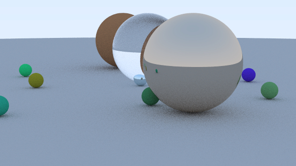

# applescript-raytracer

an implementation of [raytracing in one weekend](https://raytracing.github.io/books/RayTracingInOneWeekend.html) in applescript

example render:



this render took about 37 minutes

to run it yourself:

```sh
./raytracer.applescript
```

you can also edit the parameters passed to writeRaytracedImage() to adjust the resolution and quality of the rendered image, which will substantially affect the time taken to render
